<div align="center">

<!-- ═══════════════════════════════════════════════════════════════ -->
<!-- ✦  COSMIC HEADER  ✦ -->
<!-- ═══════════════════════════════════════════════════════════════ -->



<br/>

<!-- ═══════════════════════════════════════════════════════════════ -->
<!-- ✦  TYPING SVG  ✦ -->
<!-- ═══════════════════════════════════════════════════════════════ -->

<a href="https://git.io/typing-svg">
  
</a>

<br/>

<!-- Profile views -->


</div>

<br/>

<!-- ═══════════════════════════════════════════════════════════════ -->
<!-- ✦  INTERCEPTED TRANSMISSION — ABOUT ME  ✦ -->
<!-- ═══════════════════════════════════════════════════════════════ -->

<div align="center">
<table>
<tr>
<td>

```
╔══════════════════════════════════════════════════════════════════╗
║  📡 SIGNAL INTERCEPTED                                          ║
║  ORIGIN: PLEIADES CLUSTER · SECTOR 7-G                          ║
║  FREQUENCY: 42.157 GHz · ENCRYPTION: NONE                       ║
║  DECRYPTION: ██████████████████████████████████████████ COMPLETE ║
╚══════════════════════════════════════════════════════════════════╝
```

</td>
</tr>
</table>
</div>

<div align="center">
<i>

> *I don't just write code — I craft worlds. Every project is a story waiting to unfold,*
> *every function a sentence in a larger narrative. I'm an Author who speaks in*
> *JavaScript and Python, a Designer who paints with pixels and algorithms,*
> *an Inventor who turns "what if" into "what is."*
>
> *I build unique experiences — the kind that make you pause, lean in, and wonder*
> *how it was made. From AI systems that think alongside you to interfaces*
> *that feel alive, I exist at the intersection of imagination and engineering.*
>
> *Some people write code. I compose it.*

</i>
</div>

<br/>

<!-- ═══════════════════════════════════════════════════════════════ -->
<!-- ✦  STAR SYSTEMS — SKILLS CONSTELLATION  ✦ -->
<!-- ═══════════════════════════════════════════════════════════════ -->

<div align="center">



</div>

<br/>

<!-- ═══════════════════════════════════════════════════════════════ -->
<!-- ✦  MISSION LOGS — FEATURED PROJECTS  ✦ -->
<!-- ═══════════════════════════════════════════════════════════════ -->

<div align="center">

<h3>

&ensp;M I S S I O N &ensp; L O G S&ensp;

</h3>

</div>

<br/>

<details>
<summary>
&ensp;⟐&ensp;<code>MISSION::GENESIS-1</code>&ensp;—&ensp;<b>Portfolio Universe</b>&ensp;

</summary>
<br/>

> **Classification:** Top Secret · **Sector:** Web Development
>
> A living, breathing portfolio that isn't just a page — it's an experience.
> Built with React and animated to feel like navigating through space itself.
>
> `React` · `Three.js` · `Framer Motion` · `TypeScript`

<!-- 🔗 Replace with your actual repo link -->
<!-- [► View Mission Files](https://github.com/Shak-Shat/YOUR-REPO) -->

</details>

<details>
<summary>
&ensp;⟐&ensp;<code>MISSION::NEURAL-7</code>&ensp;—&ensp;<b>AI Story Engine</b>&ensp;

</summary>
<br/>

> **Classification:** Confidential · **Sector:** AI / Machine Learning
>
> An intelligent narrative engine that co-creates stories with humans.
> Blending LLMs with creative writing to push the boundaries of interactive fiction.
>
> `Python` · `PyTorch` · `LangChain` · `Next.js`

<!-- 🔗 Replace with your actual repo link -->
<!-- [► View Mission Files](https://github.com/Shak-Shat/YOUR-REPO) -->

</details>

<details>
<summary>
&ensp;⟐&ensp;<code>MISSION::PRISM-4</code>&ensp;—&ensp;<b>Design System</b>&ensp;

</summary>
<br/>

> **Classification:** Open · **Sector:** Design / Frontend
>
> A component library that doesn't just look good — it tells a visual story.
> Every interaction is intentional, every animation purposeful.
>
> `TypeScript` · `React` · `Storybook` · `Tailwind CSS`

<!-- 🔗 Replace with your actual repo link -->
<!-- [► View Mission Files](https://github.com/Shak-Shat/YOUR-REPO) -->

</details>

<details>
<summary>
&ensp;⟐&ensp;<code>MISSION::ATLAS-9</code>&ensp;—&ensp;<b>Data Voyager</b>&ensp;

</summary>
<br/>

> **Classification:** Restricted · **Sector:** Data Science
>
> Turning raw data into visual narratives. An exploration tool that makes
> complex datasets feel like interactive stories anyone can understand.
>
> `Python` · `D3.js` · `Pandas` · `FastAPI`

<!-- 🔗 Replace with your actual repo link -->
<!-- [► View Mission Files](https://github.com/Shak-Shat/YOUR-REPO) -->

</details>

<br/>

<div align="center">
<sub><i>// Mission logs are placeholders — replace with your actual projects! (see HTML comments)</i></sub>
</div>

<br/>

<!-- ═══════════════════════════════════════════════════════════════ -->
<!-- ✦  STELLAR METRICS — GITHUB STATS  ✦ -->
<!-- ═══════════════════════════════════════════════════════════════ -->

<div align="center">

<h3>

&ensp;S T E L L A R &ensp; M E T R I C S&ensp;

</h3>

<br/>

<table>
<tr>
<td>

</td>
<td>

</td>
</tr>
</table>

<br/>


</div>

<br/>

<!-- ═══════════════════════════════════════════════════════════════ -->
<!-- ✦  ACTIVITY GRAPH  ✦ -->
<!-- ═══════════════════════════════════════════════════════════════ -->

<div align="center">


</div>

<br/>

<!-- ═══════════════════════════════════════════════════════════════ -->
<!-- ✦  CONTRIBUTION SNAKE  ✦ -->
<!-- ═══════════════════════════════════════════════════════════════ -->

<!--
  To enable the snake animation:
  1. Go to your repo → Actions → New Workflow
  2. Create .github/workflows/snake.yml with the Platane/snk action
  3. Uncomment the image below and replace with your generated SVG path

<div align="center">
  
</div>
-->

<!-- ═══════════════════════════════════════════════════════════════ -->
<!-- ✦  WARP COORDINATES — CONTACT  ✦ -->
<!-- ═══════════════════════════════════════════════════════════════ -->

<div align="center">

<h3>

&ensp;W A R P &ensp; C O O R D I N A T E S&ensp;

</h3>

<sub>Open channels for interstellar communication</sub>

<br/><br/>

<!-- Replace # with your actual links -->

<a href="https://github.com/Shak-Shat">
  
</a>
&ensp;
<a href="#">
  
</a>
&ensp;
<a href="#">
  
</a>
&ensp;
<a href="#">
  
</a>

</div>

<br/><br/>

<!-- ═══════════════════════════════════════════════════════════════ -->
<!-- ✦  COSMIC FOOTER  ✦ -->
<!-- ═══════════════════════════════════════════════════════════════ -->

<div align="center">



</div>

<!--

  ┌─────────────────────────────────────────────────────┐
  │  ✦  CUSTOMIZATION GUIDE                             │
  │                                                     │
  │  1. MISSION LOGS: Replace placeholder projects      │
  │     with your real repos. Update names, badges,     │
  │     descriptions, and uncomment the links.          │
  │                                                     │
  │  2. WARP COORDINATES: Replace # in social links     │
  │     with your actual LinkedIn, portfolio, and        │
  │     email URLs.                                     │
  │                                                     │
  │  3. CONSTELLATION: Edit assets/constellation.svg    │
  │     to add/remove/rename skills in each nebula.     │
  │                                                     │
  │  4. SNAKE: Set up the GitHub Actions workflow       │
  │     for the contribution snake animation.           │
  │                                                     │
  │  5. ABOUT ME: Edit the transmission text to         │
  │     better match your personal story.               │
  └─────────────────────────────────────────────────────┘

-->
